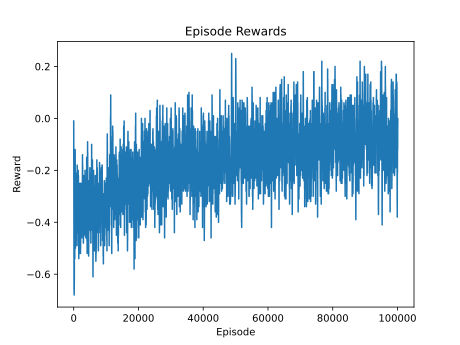
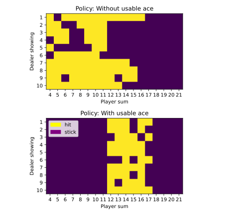
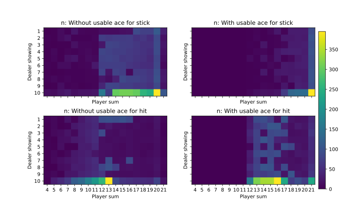
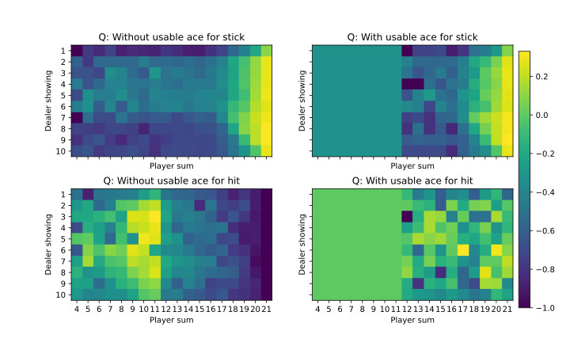
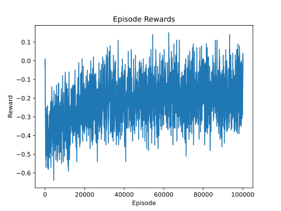
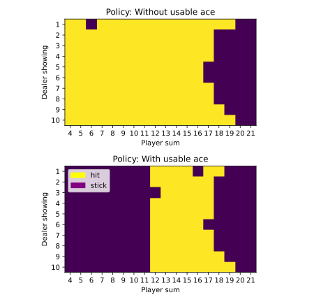
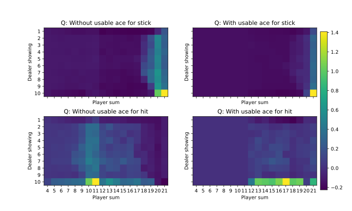

# Setup
The easiest way to try this code repository is to run it in a pre-built docker container and to connect the development container through Visual 
Studio Code and Dev Container extension. The Dockerfile and devcontainer.json needed for this setup locates in the setup folder, and docker 
commands to build the docker image and to create the named volume are as the below.

## Docker Container
```
docker build -t alan/mdp:1.0.0 .
```

## Docker Volume
```
docker volume create vol-workspace
```

# MonteCarlo
## How to use
The MonteCarlo class implements an on-policy &epsilon;-Greedy tabular method. Both state and action space has to be discrete. Gymnasium's Toy 
Text environments like Blackjack, Taxi, Cliff Walking and Frozen Lake could be solved by this class. &epsilon; decays exponentially. Its decay 
rate can be controlled by keyword arguments of MonteCarlo constructor *epsilonHalfLife*. Both first-visit and every-visit variants of Monte 
Carlo method are supported. It can be controlled by keyword argument *visit* being 'first' or 'every' (default).
```
import gymnasium as gym
from src import MC

# training
env = gym.make('Blackjack-v1', natural=False, sab=False)
agt = MC.MonteCarlo(env)
agt.train(10000)

# save the trained model
agt.save('mc.pkl')

# testing - greedy
state, info = env.reset()
action = agt.getAction(state, info)

# load the trained model
agt.load('mc.pkl')
```

## Example - Blackjack
As shown in Figure 1, the moving average of total episode rewards get improved. The more episodes it learns from, the higher average reward 
the target policy can lead to. 



The learned target policy is shown in Figure 2. In some states, obviously, the best action shouldn't be 'stick'. 



Looking into the private member variable _n and _Q as shown in Figure 3 and 4, we can see those states are seldom or never visited. It's a 
clue of insufficient training episodes.





Figure 1 ~ 4 can be helpful tools to understand whether more training is needed. The code to plot them is included in test cases.

# Temporal Difference
## How to use
The TemporalDifference class implements an on-policy TD(0) - Sarsa with &epsilon;-Greedy tabular method. Both state and action space has to 
be discrete. Gymnasium's Toy Text environments like Blackjack, Taxi, Cliff Walking and Frozen Lake could be solved by this class. &epsilon; 
decays exponentially. Its decay rate can be controlled by keyword arguments of TemporalDifference constructor *epsilonHalfLife*, and its learning 
rate can be controlled by keyword argument *alpha*. 
```
import gymnasium as gym
from src import TD

# training
env = gym.make('Blackjack-v1', natural=False, sab=False)
agt = TD.TemporalDifference(env)
agt.train(10000)

# save the trained model
agt.save('td.pkl')

# testing - greedy
state, info = env.reset()
action = agt.getAction(state, info)

# load the trained model
agt.load('td.pkl')
```

## Example - Blackjack
As shown in Figure 5, the moving average of total episode rewards get improved. The more episodes it learns from, the higher average reward 
the target policy can lead to. 



The learned target policy is shown in Figure 6. In some states, not as many as the results of Monte Carlo method, the best action shouldn't 
be 'stick'. 





# Reference
- Carnegie Mellon University, Fragkiadaki, Katerina, et al. 2024. "10-403 Deep Reinforcement Learning" As of 8 November, 2024. 
https://cmudeeprl.github.io/403website_s24/.
- Sutton, Richard S., and Barto, Andrew G. 2018. Reinforcement Learning - An indroduction, second edition. The MIT Press.
- Towers, et al. 2024. "Gymnasium: A Standard Interface for Reinforcement Learning Environments", [arXiv:2407.17032](https://arxiv.org/abs/2407.17032).
- Farama Foundation, n.d. Gymnasium. https://github.com/farama-Foundation/gymnasium?tab=readme-ov-file
