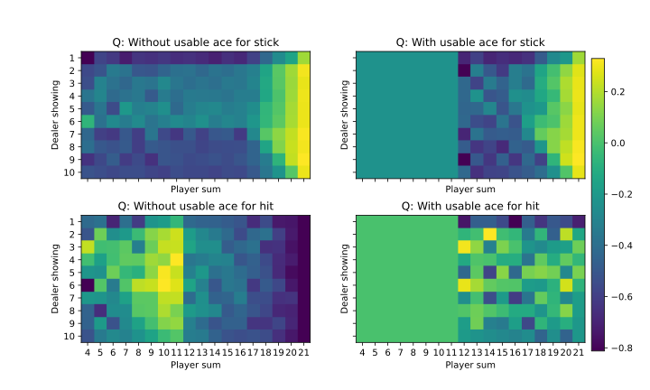

# Setup
The easiest way to try this code repository is to run it in a pre-built docker container and to connect the development container through Visual 
Studio Code and Dev Container extension. The Dockerfile and devcontainer.json needed for this setup locates in the setup folder, and docker 
commands to build the docker image and to create the named volume are as the below.

## Docker Container
```
docker build -t alan/mdp:1.0.0 .
```

## Docker Volume
```
docker volume create vol-workspace
```

# Environment - BlackJack
The moving average of total episode rewards get improved as the target policy is trained by more episode. 



